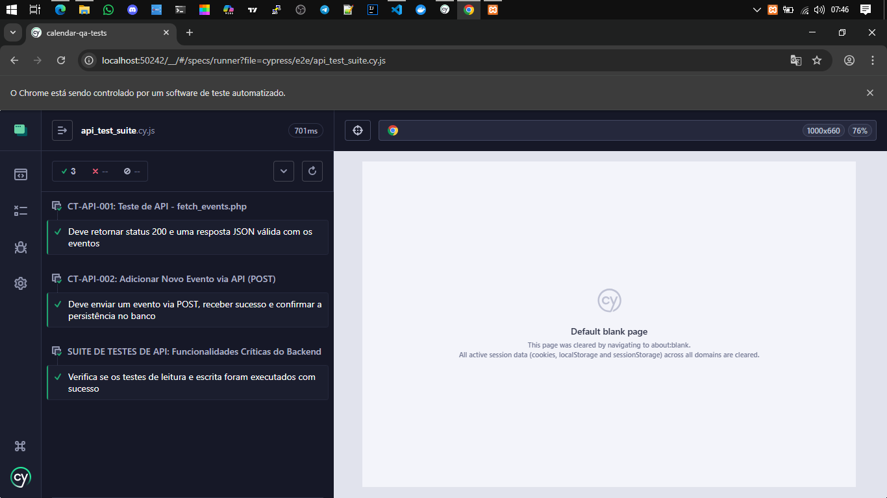

# 🛡️ Suíte de Testes de API: Calendar QA Tests

Este repositório contém a suíte de automação de testes de API para o projeto **Meu Calendário (PHP/MySQL)**, utilizando o **Cypress** para garantir a integridade dos dados e o fluxo de trabalho do *backend*.

<p align="center">
    
  </a>
</p>

---

## 💻 1. Visão Geral da Automação

| Categoria | Detalhes |
| :--- | :--- |
| **Ferramenta Principal** | **Cypress** (para testes E2E e API) |
| **Linguagem** | JavaScript (Node.js) |
| **Backend Testado** | PHP e MySQL (rodando em XAMPP) |
| **Escopo** | Validação das operações de CRUD (Criação, Leitura, Edição, Exclusão) via requisições HTTP (GET, POST). |

---

## ⚙️ 2. Como Rodar a Suíte de Testes

### Pré-requisitos
Para executar os testes, você deve ter dois ambientes ativos:
1.  **Node.js & npm** (Instalados no seu sistema operacional).
2.  **Aplicação Principal:** O projeto **`calendar-project`** deve estar rodando em um servidor local (XAMPP) e acessível em: `http://localhost/calendar-project/index.php`.

### 🛠️ Passos de Execução

Execute todos os comandos a partir do diretório **`calendar-qa-tests`**:

1.  **Instalação de Dependências:**
    ```bash
    npm install
    ```
2.  **Execução da Suíte:**
    Abra o *Test Runner* do Cypress:
    ```bash
    npx cypress open
    ```
3.  **Início:** Selecione **`api_test_suite.cy.js`** para iniciar a automação.

---

## 🎯 3. Cobertura da Suíte de API

A suíte está estruturada na pasta `cypress/e2e/` e valida os pontos mais críticos do sistema:

| ID do Teste | Funcionalidade | Endpoint | Status |
| :---: | :--- | :--- | :---: |
| **CT-API-001** | **Leitura de Eventos (GET)** | `fetch_events.php` | ✅ **Passando** |
| **CT-API-002** | **Criação de Eventos (POST)** | `calendar.php` | ✅ **Passando** |
| **CT-API-003+** | **Edição/Exclusão** | *Em desenvolvimento* | ⏳ Pendente |

### 💡 QA Insights: Solução de Bugs de Ambiente
O teste de Criação (`CT-API-002`) foi implementado com uma lógica robusta que **ignora a resposta da requisição POST** e garante o sucesso **apenas após uma consulta GET subsequente**, confirmando que os dados foram persistidos no banco. Isso contorna o **bug de *output* do XAMPP** que causava falha na desserialização do JSON.

---

## 🚨 Ação Imediata (Limpeza de Código)

Para finalizar a qualidade, por favor, use a **busca global** (`Ctrl + Shift + F`) para encontrar e **remover a frase "para evitar bugs de espaço em branco!"** do seu código-fonte PHP. Essa frase é um **bug visível** que precisa ser eliminado do produto.

---
